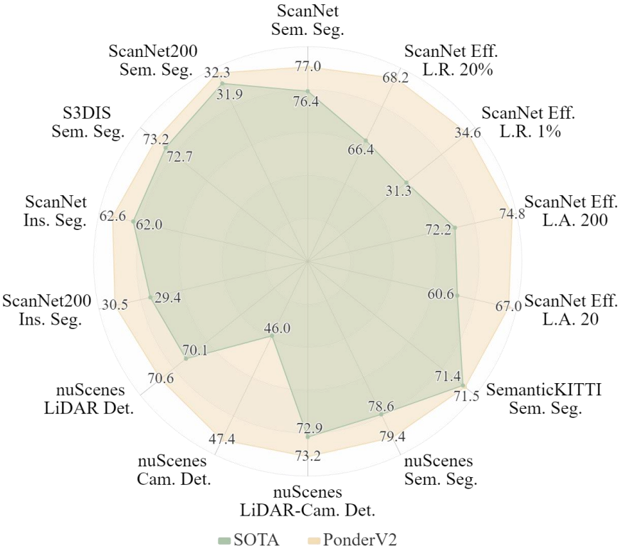
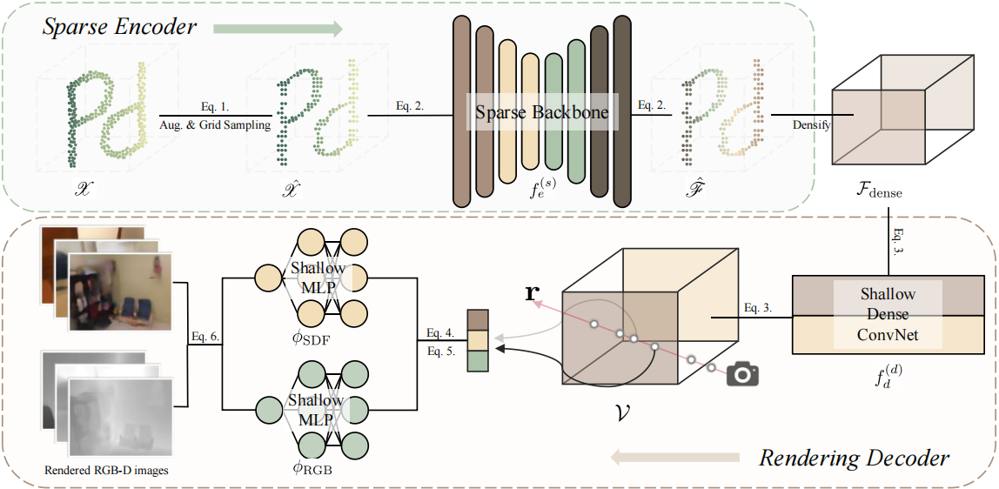

<div align='center'>

<h2>PonderV2: Pave the Way for 3D Foundation Model <br>with A Universal Pre-training Paradigm</h2>

[Haoyi Zhu](https://www.haoyizhu.site/)<sup>1,4*</sup>, [Honghui Yang](https://github.com/Nightmare-n)<sup>1,3*</sup>, [Xiaoyang Wu](https://xywu.me/)<sup>1,2*</sup>, [Di Huang](https://github.com/dihuangdh)<sup>1*</sup>, [Sha Zhang](https://github.com/zhangsha1024)<sup>1,4</sup>, [Xianglong He](https://scholar.google.com/citations?hl=zh-CN&user=jKFeol0AAAAJ)<sup>1</sup>,
<br>
[Tong He](http://tonghe90.github.io/)<sup>1</sup>, [Hengshuang Zhao](https://hszhao.github.io/)<sup>2</sup>, [Chunhua Shen](https://cshen.github.io/)<sup>3</sup>, [Yu Qiao](https://mmlab.siat.ac.cn/yuqiao/)<sup>1</sup>, [Wanli Ouyang](https://wlouyang.github.io/)<sup>1</sup>
 
<sup>1</sup>[Shanghai AI Lab](https://www.shlab.org.cn/), <sup>2</sup>[HKU](https://www.hku.hk/), <sup>3</sup>[ZJU](https://www.zju.edu.cn/), <sup>4</sup>[USTC](https://en.ustc.edu.cn/) 

[](https://paperswithcode.com/sota/semantic-segmentation-on-scannet?p=ponderv2-pave-the-way-for-3d-foundataion)<br>
[](https://paperswithcode.com/sota/3d-semantic-segmentation-on-scannet200?p=ponderv2-pave-the-way-for-3d-foundataion)<br>
[](https://paperswithcode.com/sota/semantic-segmentation-on-s3dis?p=ponderv2-pave-the-way-for-3d-foundataion)

</div>


<p align="center">
    
</p>


This is the official implementation of paper "PonderV2: Pave the Way for 3D Foundation Model with A Universal Pre-training Paradigm". 

PonderV2 is a comprehensive 3D pre-training framework designed to facilitate the acquisition of efficient 3D representations, thereby establishing a pathway to 3D foundational models. It is a novel universal paradigm to learn point cloud representations by differentiable neural rendering, serving as a bridge between 3D and 2D worlds. 

<p align="center">
    
</p>

## News:
- *Dec. 2023*: Multi-dataset training supported! More instructions on installation and usage are available. Please check out!
- *Nov. 2023*: [**Model files**](./ponder/models/ponder/) are released! Usage instructions, complete codes and checkpoints are coming soon!
- *Oct. 2023*: **PonderV2** is released on [arXiv](https://arxiv.org/abs/2310.08586), code will be made public and supported by [Pointcept](https://github.com/Pointcept/Pointcept) soon.

## Installation
This repository is mainly based on [Pointcept](https://github.com/Pointcept/Pointcept).

### Requirements
- Ubuntu: 18.04 or higher
- CUDA: 11.3 or higher
- PyTorch: 1.10.0 or higher

### Conda Environment
```bash
conda create -n ponderv2 python=3.8 -y
conda activate ponderv2
# Choose version you want here: https://pytorch.org/get-started/previous-versions/
conda install pytorch==1.12.1 torchvision==0.13.1 torchaudio==0.12.1 cudatoolkit=11.3 -c pytorch -y
conda install h5py pyyaml -c anaconda -y
conda install sharedarray tensorboard tensorboardx addict einops scipy plyfile termcolor timm -c conda-forge -y
conda install pytorch-cluster pytorch-scatter pytorch-sparse -c pyg -y
pip install torch-geometric yapf==0.40.1 opencv-python open3d==0.10.0 imageio
pip install git+https://github.com/openai/CLIP.git

# spconv (SparseUNet)
# refer https://github.com/traveller59/spconv
pip install spconv-cu113

# NeuS renderer
cd libs/smooth-sampler
# usual
python setup.py install
# docker & multi GPU arch
TORCH_CUDA_ARCH_LIST="ARCH LIST" python setup.py install
# e.g. 7.5: RTX 3000; 8.0: a100 More available in: https://developer.nvidia.com/cuda-gpus
TORCH_CUDA_ARCH_LIST="7.5 8.0" python setup.py install
cd ../..
```

## Data Preparation
Please check out [docs/data_preparation.md](docs/data_preparation.md)

## Quick Start:
- **Pretraining**: Pretrain PonderV2 on indoor or outdoor datasets.

Pre-train PonderV2 (indoor) on single ScanNet dataset with 8 GPUs:
```bash
# -g: number of GPUs
# -d: dataset
# -c: config file, the final config is ./config/${-d}/${-c}.py
# -n: experiment name
bash scripts/train.sh -g 8 -d scannet -c pretrain-ponder-spunet-v1m1-0-base -n ponderv2-pretrain-sc
```

Pre-train PonderV2 (indoor) on ScanNet, S3DIS and Structured3D datasets using [Point Prompt Training (PPT)](https://arxiv.org/abs/2308.09718) with 8 GPUs:
```bash
bash scripts/train.sh -g 8 -d scannet -c pretrain-ponder-ppt-v1m1-0-sc-s3-st-spunet -n ponderv2-pretrain-sc-s3-st
```

Pre-train PonderV2 (outdoor) on single nuScenes dataset with 4 GPUs:
```bash
bash scripts/train.sh -g 4 -d nuscenes -c pretrain-ponder-spunet-v1m1-0-base -n ponderv2-pretrain-nu
```

- **Finetuning**: Finetune on downstream tasks with PonderV2 pre-trained checkpoints.

Finetune PonderV2 on ScanNet semantic segmentation downstream task with PPT:
```bash
# -w: path to checkpoint
bash scripts/train.sh -g 8 -d scannet -c semseg-ppt-v1m1-0-sc-s3-st-spunet-lovasz-ft -n ponderv2-semseg-ft -w ${PATH/TO/CHECKPOINT}
```

- **Testing**: Test a finetuned model on a downstream task.
```bash
# Based on experiment folder created by training script
bash scripts/test.sh -g 8 -d scannet -n ponderv2-semseg-ft -w ${CHECKPOINT/NAME}
```

For more detailed options and examples, please refer to [docs/getting_started.md](docs/getting_started.md).

For more outdoor pre-training and downstream information, you can also refer to [UniPAD](https://github.com/Nightmare-n/UniPAD). 

## Todo:
- [x] add instructions on installation and usage
- [x] add ScanNet w. RGB-D dataloader and data pre-processing scripts
- [x] add multi-dataset loader and trainer
- [x] add multi-dataset point prompt training model
- [ ] add more pre-training and finetuning configs
- [ ] add pre-trained checkpoints

## Citation
```bib
@article{zhu2023ponderv2,
  title={PonderV2: Pave the Way for 3D Foundation Model with A Universal Pre-training Paradigm}, 
  author={Haoyi Zhu and Honghui Yang and Xiaoyang Wu and Di Huang and Sha Zhang and Xianglong He and Tong He and Hengshuang Zhao and Chunhua Shen and Yu Qiao and Wanli Ouyang},
  journal={arXiv preprint arXiv:2310.08586},
  year={2023}
}

@inproceedings{huang2023ponder,
  title={Ponder: Point cloud pre-training via neural rendering},
  author={Huang, Di and Peng, Sida and He, Tong and Yang, Honghui and Zhou, Xiaowei and Ouyang, Wanli},
  booktitle={Proceedings of the IEEE/CVF International Conference on Computer Vision},
  pages={16089--16098},
  year={2023}
}

@article{yang2023unipad,
  title={UniPAD: A Universal Pre-training Paradigm for Autonomous Driving}, 
  author={Honghui Yang and Sha Zhang and Di Huang and Xiaoyang Wu and Haoyi Zhu and Tong He and Shixiang Tang and Hengshuang Zhao and Qibo Qiu and Binbin Lin and Xiaofei He and Wanli Ouyang},
  journal={arXiv preprint arXiv:2310.08370},
  year={2023},
}
```

## Acknowledgement
This project is mainly based on the following codebases. Thanks for their great works!
- [SDFStudio](https://github.com/autonomousvision/sdfstudio)
- [Pointcept](https://github.com/Pointcept/Pointcept)